<!-- PDF 打印提示：建议使用支持 Mermaid 渲染的 Markdown 工具（如 Typora / VS Code + Markdown Preview Mermaid）导出 PDF -->

# AI 视频安全智能体平台

## 产品功能宣传手册

**让每一个摄像头成为会思考的安全智能体**

 

|  |  |
|:---:|:---|
| **文档版本** | V1.0 |
| **发布日期** | 2026 年 8 月 |
| **适用对象** | 企业客户 / 行业合作伙伴 |

---

## 目录

| 章节 | 内容 |
|------|------|
| [一、关于平台](#一关于平台) | 平台定位与核心理念 |
| [二、核心价值](#二核心价值) | 四大核心价值主张 |
| [三、场景全景](#三场景全景) | 十二大应用场景一览 |
| [四、行业方案](#四行业方案) | 分行业解决方案详解 |
| [五、平台架构](#五平台架构) | 四层智能体架构设计 |
| [六、智能体工作流](#六智能体工作流) | 从感知到执行的完整闭环 |
| [七、技术亮点](#七技术亮点) | 核心技术能力概览 |
| [八、为什么选择我们](#八为什么选择我们) | 平台竞争优势 |
| [九、联系我们](#九联系我们) | 合作与咨询 |

---

## 一、关于平台

### 平台定位

**AI 视频安全智能体平台** 是下一代视频监控解决方案。我们不只是让摄像头"看得见"，更让它"看得懂、会判断、能行动"。

传统视频监控系统停留在"记录 + 事后查阅"阶段，需要人工值守、被动响应。我们的平台将每一个摄像头升级为具备场景理解能力的 **AI 智能体节点**，实现从"被动监控"到"主动防护"的根本性跨越。

### 核心理念：从检测到决策

> 传统监控：摄像头拍到画面 → 人工发现异常 → 事后处理
>
> AI 智能体：摄像头感知画面 → AI 理解场景 → 智能判断风险 → 自动决策执行 → 闭环反馈优化

### 传统监控 vs AI 智能体平台

| 对比维度 | 传统视频监控 | AI 视频安全智能体平台 |
|----------|------------|---------------------|
| 工作模式 | 被动记录，事后查阅 | 主动感知，实时决策 |
| 告警方式 | 人工值守，漏报率高 | AI 自动识别，秒级告警 |
| 分析能力 | 仅存储画面 | 行为理解 + 风险判断 + 多模态分析 |
| 响应速度 | 分钟级（依赖人工） | 秒级（自动触发） |
| 系统联动 | 独立运行 | 联动 WMS / MES / 消防 / 门禁等业务系统 |
| 数据价值 | 仅作证据留存 | 趋势分析 + 预测性维护 + 决策辅助 |
| 部署方式 | 中心化服务器 | 边缘 + 云端协同部署 |

---

## 二、核心价值

### 价值一：秒级感知，主动防护

平台基于边缘 AI 实时分析视频流，从事件发生到告警推送 **延迟 < 3 秒**。不再是事后查录像，而是事发瞬间主动介入。

### 价值二：不止告警，更是决策

传统系统只告诉你"发生了什么"。我们的智能体告诉你"发生了什么 → 严重程度如何 → 该怎么处理"，并自动执行处置策略。

### 价值三：一个平台，覆盖全场景

从工厂安全到老人照护，从工业质检到智慧城市，**十二大场景**统一平台管理，无需为不同需求采购多套系统。

### 价值四：多模态融合，超越视觉

不只是看视频。平台融合视频画面 + IoT 传感器数据 + 业务系统信息，形成多维度交叉验证，大幅降低误报率。

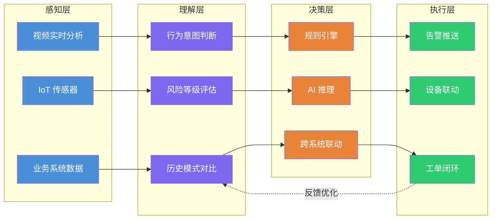

---

## 三、场景全景

平台覆盖 **十二大应用场景**，横跨工业、民生、城市治理三大领域，提供开箱即用的行业级解决方案。

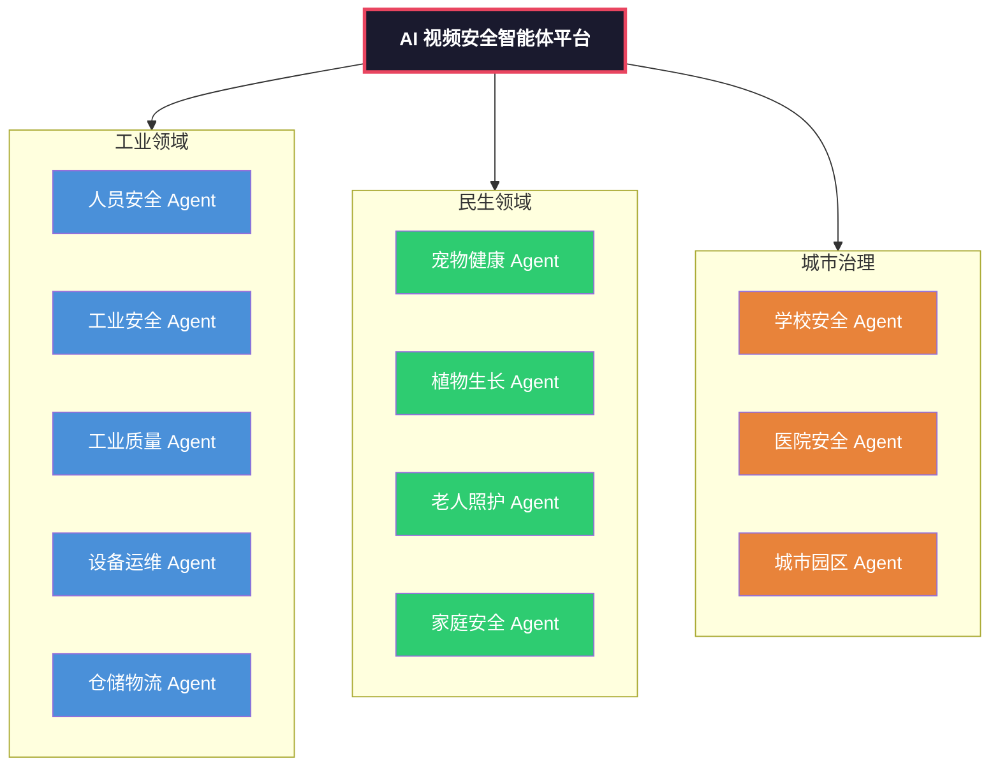

### 场景一览表

| Agent | 核心场景 | 适用行业 |
|-------|----------|----------|
| 人员安全 Agent | 入侵、打架、跌倒、徘徊、聚集 | 工厂、实验室、学校、医院、园区、家庭 |
| 工业安全 Agent | PPE、危险区域、违规操作、消防、人车混行、高危作业 | 工厂、工地、矿山、化工 |
| 工业质量 Agent | 外观检测、装配检测、缺陷检测、包装检测、OCR、尺寸/位置检测 | 制造业、食品、电子、包装 |
| 设备运维 Agent | 设备异常、漏液、冒烟、火灾、异常振动、异常状态 | 工厂、数据中心、能源 |
| 仓储物流 Agent | 货物、货架、叉车、人员、通道、WMS 联动 | 仓储、物流、制造 |
| 城市园区 Agent | 人、车、消防、道路、环境、公共安全 | 园区、社区、城市治理 |
| 宠物健康 Agent | 行为、饮食、饮水、活动、皮肤、疾病风险 | 宠物行业、家庭 |
| 植物生长 Agent | 水、肥、光、温度、病虫害、修剪 | 农业、园艺、家庭 |
| 老人照护 Agent | 安全、健康行为、日常生活、异常事件、家属通知 | 养老、社区、家庭 |
| 家庭安全 Agent | 防盗、消防、儿童、老人、宠物、环境 | 家庭、商铺 |
| 学校安全 Agent | 校园安全、宿舍安全、食堂安全 | 学校、教育机构 |
| 医院安全 Agent | 患者安全、医护合规、医疗环境 | 医院、医疗机构 |

---

## 四、行业方案

### 4.1 工厂安全生产解决方案

> **适用场景：** 制造工厂、化工园区、建筑工地、矿山作业

#### 产品亮点

- **PPE 全套智能合规检测**：安全帽、反光衣、防护服、安全带、护目镜、手套、口罩——一键配置，7 类防护装备同时检测，不漏检、不误判
- **高危作业实时监管**：动火、高处、受限空间、吊装四大高危作业全程 AI 盯防，违规即告警
- **人车协同安全**：叉车接近人员自动预警，人车混行区域风险实时识别，盲区风险提前介入
- **安全事件全闭环**：从发现违规到生成报告、关联培训记录、推送整改，全流程自动化

#### 检测能力清单

| 能力类别 | 检测项 | 产品亮点 |
|----------|--------|----------|
| PPE 合规 | 安全帽（未戴/颜色不符/脱落）、反光衣、防护服、安全带、护目镜、手套、口罩 | 支持 7 类装备同步检测，自定义合规规则 |
| 危险区域管控 | 电子围栏越线、禁入区域闯入、接近危险设备、违规操作 | 支持多区域绘制，告警级别分级 |
| 高危作业监管 | 动火作业（人员/PPE/可燃物）、高处作业（安全带/平台）、受限空间（进出/滞留）、吊装作业 | 四大高危场景开箱即用模板 |
| 人车协同 | 叉车接近预警、人车混行、车辆超速、盲区风险 | 支持叉车/车辆类型识别 |

#### 智能体工作流示例

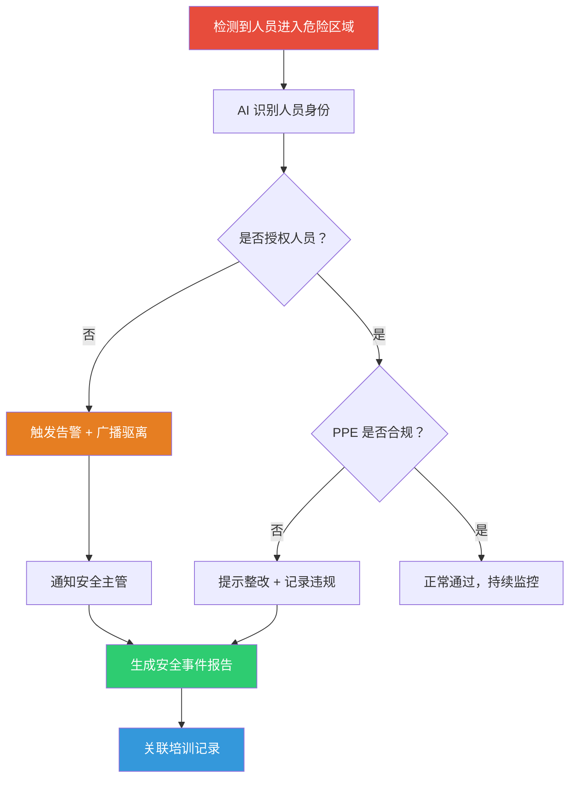

---

### 4.2 工业质量检测解决方案

> **适用场景：** 制造业产线、电子装配、食品包装、注塑成型

#### 产品亮点

- **摄像头变质检工具**：无需专用检测设备，普通工业摄像头即可实现高精度缺陷检测，部署成本降低 60%+
- **质检闭环而非单点告警**：从"发现缺陷"到"定位问题工序→统计缺陷率→预警良率下降→联动 MES 隔离返工"，全链路自动化
- **多维度缺陷分类**：外观、装配、包装三大类共 20+ 缺陷类型，按严重程度自动分级
- **趋势分析驱动持续改善**：按类型/批次/时段统计缺陷率，自动追溯生产环节，辅助定位根因

#### 检测能力清单

| 能力类别 | 检测项 | 产品亮点 |
|----------|--------|----------|
| 外观缺陷 | 划痕、裂纹、凹陷、破损、毛刺、污渍、色差、锈蚀、变形 | 支持多角度检测，亚毫米级精度 |
| 装配质量 | 零件缺失/装反/错位、螺丝缺失/未拧紧、接插件未到位、线缆错接、胶水缺失、焊点异常 | 装配工序全节点覆盖 |
| 包装检测 | 破损、标签错误/缺失、数量错误、型号错误、箱体变形、封箱异常 | 支持 OCR 文字识别 |

#### 智能体工作流示例

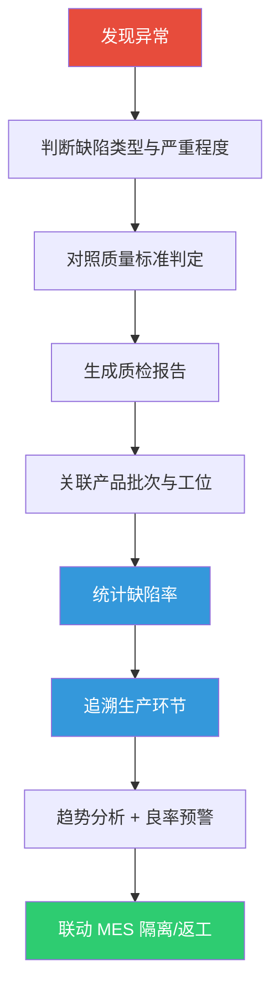

---

### 4.3 设备运维解决方案

> **适用场景：** 工厂设备管理、数据中心运维、能源行业、化工设备

#### 产品亮点

- **视频 + IoT 多模态融合**：摄像头看到漏液，同时调取温度和振动传感器数据，交叉验证后再判断——误报率降低 80%+
- **预测性维护**：不是等设备坏了再修，而是根据多维度异常趋势提前生成维护工单，减少非计划停机
- **自动巡检替代人工**：摄像头/巡检机器人按预设路线自动巡检，视觉确认设备状态，自动生成点检记录
- **闭环验证**：工单派发 → 维修执行 → 修复后重新视觉检测确认——确保问题真正解决

#### 检测能力清单

| 能力类别 | 检测项 | 产品亮点 |
|----------|--------|----------|
| 视觉异常 | 冒烟、明火、漏液、异常灯光、异物附着、防护罩缺失 | 7×24 不间断视觉巡检 |
| IoT 联动 | 温度异常、振动异常、压力异常、电流/电压异常、气体泄漏 | 支持主流工业传感器协议 |
| 运维场景 | 自动巡检、设备状态识别、环境监测、点检表数字化 | 替代人工巡检，效率提升 5 倍+ |

#### 智能体工作流示例

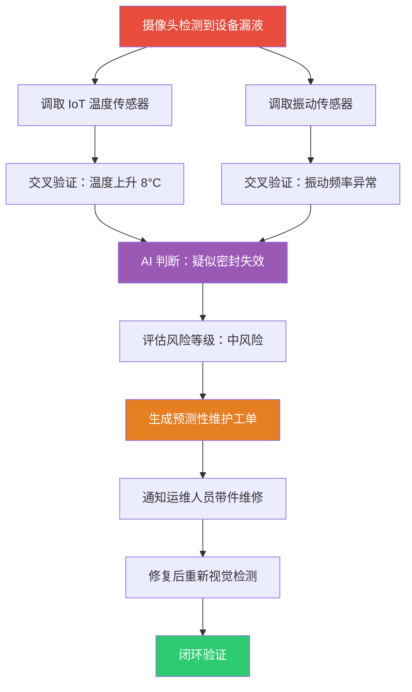

---

### 4.4 仓储物流解决方案

> **适用场景：** 仓库管理、物流分拨中心、制造仓储、冷链仓储

#### 产品亮点

- **视频 + WMS 双系统联动**：摄像头发现货物位置异常，自动查询仓储管理系统核对正确库位，判断是否错放——无需人工逐一排查
- **叉车安全全维度管控**：超速、违规载人、进入禁区、接近人员、货物超高/倾斜，一键开启全部叉车安全规则
- **货架与通道实时监控**：货架倾斜/超载预警、通道堵塞/消防通道占用自动发现，避免安全隐患积累
- **异常处理全闭环**：发现异常 → 创建事件 → 通知管理员 → 生成工单 → 跟踪整改——确保每个异常都得到处置

#### 检测能力清单

| 能力类别 | 检测项 | 产品亮点 |
|----------|--------|----------|
| 仓库安全 | 人员闯入、货物倒塌/堆放异常/倾斜、货架倾斜/超载、通道堵塞/消防占用、货物缺失/错放/破损 | 货位级精细管理 |
| 叉车安全 | 超速、违规载人、进入禁区、接近人员、人车混行、货物超高/倾斜 | 支持叉车类型识别与轨迹追踪 |
| 系统联动 | WMS 库位核对、异常事件创建、工单生成与跟踪 | 标准 API 对接主流 WMS |

#### 智能体工作流示例

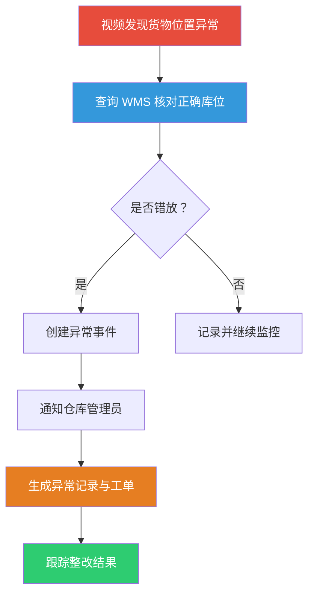

---

### 4.5 宠物健康智能体解决方案

> **适用场景：** 家庭宠物看护、宠物店/宠物医院、养殖场

#### 产品亮点

- **从"看宠物"升级为"懂宠物"**：不是简单地推送"宠物在动"，而是建立个体行为基线，发现活动量、饮食、行为的异常偏离
- **多维度关联健康分析**：活动量下降 + 进食减少 + 频繁抓挠 → AI 判断健康异常风险 → 通知主人 → 建议就医——真正的健康智能体
- **健康周报自动生成**：每周自动生成宠物行为与健康趋势报告，让主人一目了然
- **异常实时推送**：打架、持续吠叫、异常奔跑、长时间静止等紧急事件秒级推送

#### 监测能力清单

| 能力类别 | 监测项 | 产品亮点 |
|----------|--------|----------|
| 行为监测 | 狂躁、打架、撕咬、异常攻击、持续吠叫/嚎叫、异常奔跑/躲藏、长时间静止、活动量下降 | 个体行为基线建模 |
| 饮食饮水 | 进食次数/量变化、长时间不进食、饮水量变化、异常暴饮/饮水 | 自动统计趋势变化 |
| 身体状态 | 掉毛/局部脱毛、皮肤异常/红肿、抓挠频繁、舔舐异常、步态异常/跛行、呕吐、排泄异常 | 多维度交叉关联 |

#### 智能体工作流示例

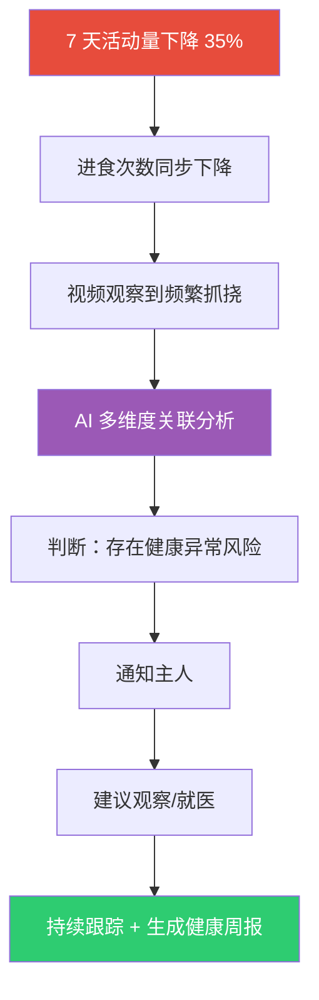

---

### 4.6 植物生长智能体解决方案

> **适用场景：** 现代农业大棚、园艺种植、家庭花园、植物工厂

#### 产品亮点

- **视频 + 环境传感器闭环**：摄像头看到叶片萎蔫，自动读取土壤湿度、光照数据，AI 综合判断缺水概率，自动启动灌溉——30 分钟后复检确认恢复
- **病虫害早期预警**：叶斑病、白粉病、真菌感染、虫害——在肉眼还难以察觉时提前发现
- **农事建议智能化**：不只是发现问题，更给出"是否需要浇水、施肥、修剪"的具体建议
- **自动执行 + 闭环验证**：联动灌溉/施肥设备自动执行，执行后视觉复检确认效果，持续优化策略

#### 监测能力清单

| 能力类别 | 监测项 | 产品亮点 |
|----------|--------|----------|
| 环境监测 | 光照不足/过强、温度异常、湿度异常、土壤湿度不足、CO₂ 异常 | 融合多类环境传感器 |
| 营养监测 | 缺氮/磷/钾/铁、营养不良 | 叶片视觉分析 + 土壤数据关联 |
| 生长状态 | 生长缓慢、徒长、叶片异常、黄叶/枯叶/萎蔫、枝叶过密、需要修剪 | 生长趋势追踪 |
| 病虫害 | 虫害、真菌感染、叶斑病、白粉病、根部异常 | 早期预警，减少损失 |

#### 智能体工作流示例

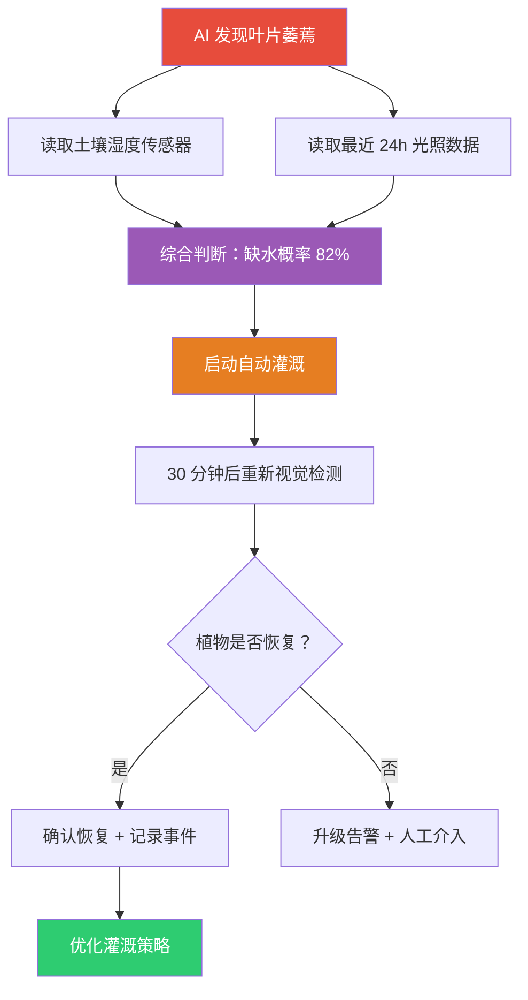

---

### 4.7 老人照护智能体解决方案

> **适用场景：** 居家养老、养老院/护理机构、社区养老、独居老人看护

#### 产品亮点

- **基于行为基线的主动判断**：系统学习老人日常行为规律（起床时间、活动轨迹、饮食作息），当行为偏离历史模式时主动预警——不是等事故发生才响应
- **日常生活无感监测**：是否吃饭、喝水、服药、起床、睡觉——无需佩戴设备，摄像头即可感知，老人无负担
- **跌倒秒级告警**：跌倒/坠床检测结合姿态分析和停留时间判断，排除正常弯腰/蹲下，大幅降低误报
- **多级联动响应**：通知家属 → 联动物业/社区 → 必要时联动急救——分险情分级响应

#### 监测能力清单

| 能力类别 | 监测项 | 产品亮点 |
|----------|--------|----------|
| 安全看护 | 跌倒、坠床、长时间静止、危险区域停留、夜间异常活动、离床、独自外出、走失风险 | 跌倒检测准确率 > 95% |
| 健康行为 | 行走异常、步态异常、活动量下降、长时间卧床、频繁起夜、异常坐卧、呼救、疑似疼痛/呻吟 | 步态趋势分析，辅助健康评估 |
| 日常生活 | 是否吃饭/喝水/服药、是否起床/睡觉、是否进入卫生间、是否长时间未出现 | 无感监测，无需佩戴设备 |

#### 智能体工作流示例

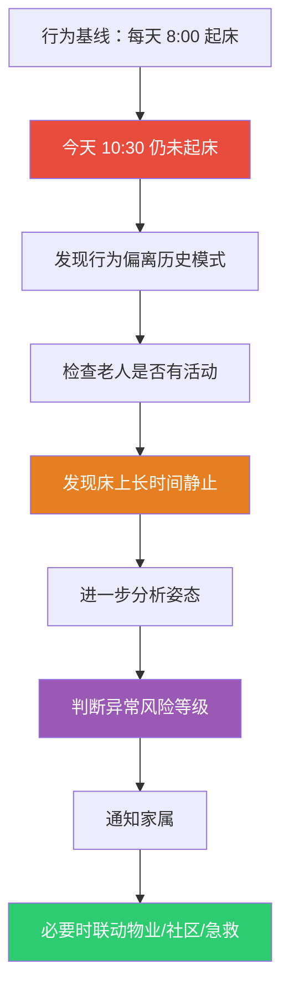

---

### 4.8 学校安全解决方案

> **适用场景：** 中小学校园、高校、职业学校、幼儿园

#### 产品亮点

- **校园安全全覆盖**：陌生人闯入、翻墙、打架、拥挤、跌倒——一套系统守护校园每个角落
- **楼梯拥挤智能疏导**：实时监测楼梯区域人员密度，超阈值自动触发广播疏导 + 通知值班教师，防患于未然
- **食堂食品安全看护**：工作人员口罩/帽子佩戴检测、异物检测、后厨违规行为——从源头守护师生饮食安全
- **校园安全日报/周报**：自动汇总安全事件，生成校园安全趋势报告，辅助管理决策

#### 检测能力清单

| 能力类别 | 检测项 | 产品亮点 |
|----------|--------|----------|
| 校园安全 | 陌生人进入、翻墙、打架、聚集、跌倒、楼梯拥挤、危险区域进入、夜间异常 | 人脸识别联动门禁 |
| 宿舍安全 | 夜间异常活动、烟火、打架、人员聚集、危险物品使用 | 宿舍区域定制规则 |
| 食堂安全 | 排队拥堵、食品卫生风险、口罩/帽子检测、异物检测、后厨违规 | 后厨 + 就餐区分区管理 |

#### 智能体工作流示例

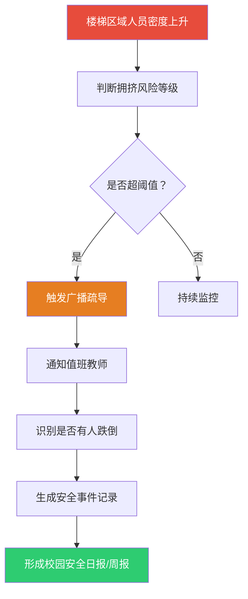

---

### 4.9 医院安全解决方案

> **适用场景：** 综合医院、专科医院、社区卫生中心、康养机构

#### 产品亮点

- **患者安全 7×24 看护**：跌倒/坠床/离床自动检测，夜间异常活动实时预警，减轻护士巡查压力
- **医护合规监督**：PPE 穿戴、无菌操作违规、危险区域进入、操作流程异常——用 AI 辅助医疗质量管理
- **未来可深度整合**：视频 + 电子病历 + IoT + 医院业务系统，构建真正的医疗 AI Agent
- **智能分级响应**：识别患者身份与行动能力，区分正常行为（如去卫生间）和异常行为（如走廊徘徊），精准告警

#### 检测能力清单

| 能力类别 | 检测项 | 产品亮点 |
|----------|--------|----------|
| 患者安全 | 跌倒、坠床、离床、异常活动、长时间静止、病区异常聚集 | 支持分病区差异化规则 |
| 医护合规 | PPE 穿戴、无菌操作违规、危险区域进入、操作流程异常 | 辅助院感管理 |
| 医疗环境 | 消防安全、通道堵塞、病区异常、医疗设备异常 | 环境安全全覆盖 |

#### 智能体工作流示例

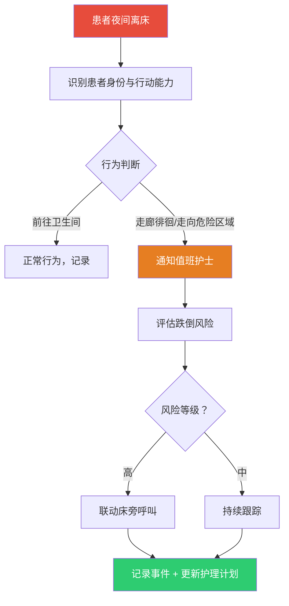

---

### 4.10 城市与园区解决方案

> **适用场景：** 产业园区、智慧社区、城市治理、交通管理

#### 产品亮点

- **园区安全一站式管理**：人员入侵、车辆违停、消防风险、施工安全——统一平台管理园区全域安全
- **城市事件智能发现**：道路拥堵、交通事故、车辆逆行、违停、行人闯入、路面积水、垃圾堆积——城市治理从人工巡查升级为 AI 自动发现
- **交通治理数据支撑**：自动统计各路口违规频次，为交通治理决策提供数据依据
- **跨系统联动**：联动交管系统、消防系统、物业系统，实现城市级事件协同处置

#### 检测能力清单

| 能力类别 | 检测项 | 产品亮点 |
|----------|--------|----------|
| 园区管理 | 人员入侵、夜间异常、车辆异常/非法停车、危险区域、消防、人员聚集、施工安全 | 园区全域一张图 |
| 城市治理 | 道路拥堵、交通事故、车辆逆行/违停、行人闯入、路面积水、道路障碍物、垃圾堆积、烟火、人群聚集 | 城市级覆盖能力 |

#### 智能体工作流示例

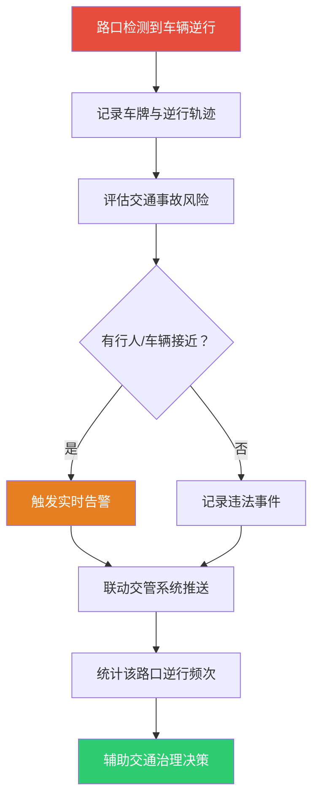

---

### 4.11 家庭安全智能体解决方案

> **适用场景：** 家庭安防、商铺看护、独居老人家庭、有儿童/宠物家庭

#### 产品亮点

- **从监控设备升级为家庭 AI 管家**：不再只是"录像存证"，而是 7×24 主动守护家庭安全的智能体
- **家庭成员多维看护**：老人跌倒、儿童危险行为、婴儿异常哭闹、宠物行为异常——一个摄像头守护全家
- **智能场景联动**：厨房火焰持续 12 分钟且家中无人 → 综合判断灶台忘关火 → 告警 + 联动关闭燃气阀门 + 通知家人——真正的智能决策
- **环境安全全覆盖**：防盗、消防、燃气、漏水、异常噪声——家庭安全不留死角

#### 检测能力清单

| 能力类别 | 检测项 | 产品亮点 |
|----------|--------|----------|
| 家庭成员 | 老人跌倒/静止、儿童危险行为/离开安全区域、婴儿异常/长时间哭闹、宠物行为异常 | 一个摄像头守护全家 |
| 家庭安全 | 入侵、门窗异常、烟火、燃气风险、漏水、异常噪声 | 环境安全全覆盖 |
| 智能联动 | 灶台火焰监控、人员位置判断、智能设备联动（关闭阀门/门禁/喷淋） | 支持主流智能家居协议 |

#### 智能体工作流示例

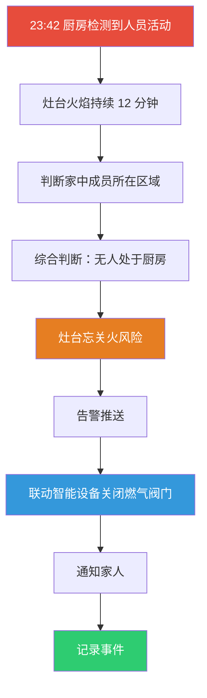

---

### 4.12 人员安全与消防预警解决方案

> **适用场景：** 所有场景的基础能力层，适用于工厂、实验室、学校、医院、园区、家庭等各类场所

#### 产品亮点

- **行为理解而非简单检测**：跌倒检测不是简单地识别"人倒在地上"，而是结合姿态分析排除蹲下/弯腰等正常动作，再结合停留时间判断是否为异常静止
- **人员异常全覆盖**：入侵、越界、翻墙、徘徊、聚集、打架、推搡、奔跑、跌倒、呼救、昏迷——18 类人员异常行为一站检测
- **消防预警前置**：烟雾/明火检测 + 消防通道/疏散通道管理 + 灭火器缺失检查——从被动消防升级为主动防火
- **风险分级智能响应**：高风险事件（跌倒/昏迷）立即告警+联动广播+通知安全员；低风险事件持续跟踪+记录——精准响应，避免告警疲劳

#### 检测能力清单

| 能力类别 | 检测项 | 产品亮点 |
|----------|--------|----------|
| 人员异常 | 非法入侵、越界、翻墙、徘徊、长时间逗留、异常聚集、打架斗殴、推搡、奔跑、倒地、跌倒、长时间静止、异常姿态、呼救、疑似昏迷、疑似突发疾病、人员失联 | 18 类行为一站检测 |
| 安全生产 | PPE 穿戴（5 类）、危险区域、违规操作、高危作业、人车混行 | 与工业安全方案联动 |
| 消防安全 | 烟雾、明火、火焰异常、消防通道占用、消防门未关闭、疏散通道堵塞、灭火器缺失、人群聚集逃生风险 | 消防设施状态自动巡检 |

#### 智能体工作流示例

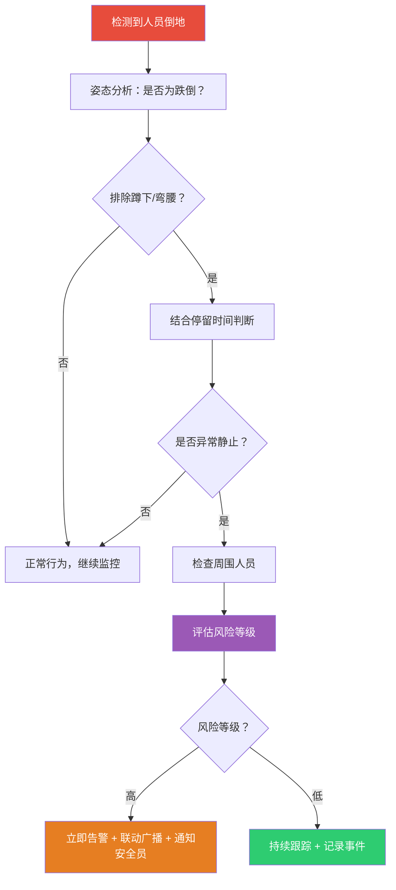

---

## 五、平台架构

### 四层智能体架构

平台采用分层架构设计，每一层可独立升级、灵活组合，适配从小型部署到城市级应用的不同规模需求。

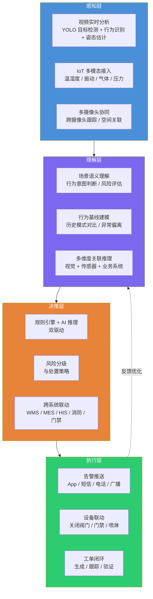

### 各层能力详解

| 层级 | 核心能力 | 说明 |
|------|----------|------|
| 感知层 | 视频实时分析 | YOLO 目标检测 + 行为识别 + 姿态估计，边缘端推理 |
| 感知层 | IoT 多模态接入 | 温湿度、振动、气体、压力传感器统一接入 |
| 感知层 | 多摄像头协同 | 跨摄像头目标跟踪、空间关联，无死角覆盖 |
| 理解层 | 场景语义理解 | 行为意图判断、风险等级评估 |
| 理解层 | 行为基线建模 | 学习个体历史行为模式，检测异常偏离 |
| 理解层 | 多维度关联推理 | 视觉 + 传感器 + 业务系统数据交叉验证 |
| 决策层 | 规则 + AI 双驱动 | 规则引擎保证确定性，AI 推理处理复杂场景 |
| 决策层 | 风险分级 | 按风险等级匹配差异化处置策略 |
| 决策层 | 跨系统联动 | 对接 WMS / MES / HIS / 消防 / 门禁等业务系统 |
| 执行层 | 告警推送 | App 推送、短信、电话、现场广播多通道告警 |
| 执行层 | 设备联动 | 自动关闭阀门、打开门禁、启动喷淋等 |
| 执行层 | 工单闭环 | 自动生成工单、跟踪处理、闭环验证 |

---

## 六、智能体工作流

### 从感知到执行的完整闭环

平台的核心竞争力在于 **闭环**。每一个安全事件都经历完整的"发现 → 理解 → 判断 → 执行 → 验证 → 优化"流程，而非简单的"检测 → 告警"。

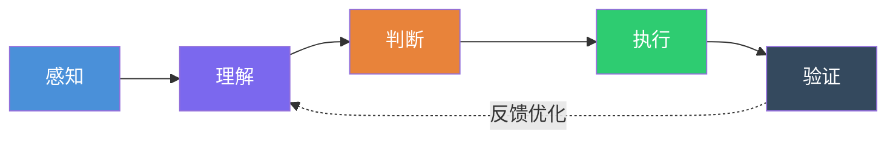

| 阶段 | 做什么 | 技术手段 |
|------|--------|----------|
| 感知 | 实时捕获视频画面与传感器数据 | YOLO 目标检测、姿态估计、IoT 数据采集 |
| 理解 | 分析行为意图，评估风险等级 | 行为识别、场景语义理解、行为基线对比 |
| 判断 | 决定是否告警及处置策略 | 规则引擎 + AI 推理、风险分级 |
| 执行 | 推送告警、联动设备、生成工单 | 多通道告警、设备联动 API、工单系统 |
| 验证 | 确认问题是否解决 | 修复后重新视觉检测、闭环确认 |
| 优化 | 持续学习，提升准确率 | 事件数据反馈模型，策略自动调优 |

---

## 七、技术亮点

### 边缘智能部署

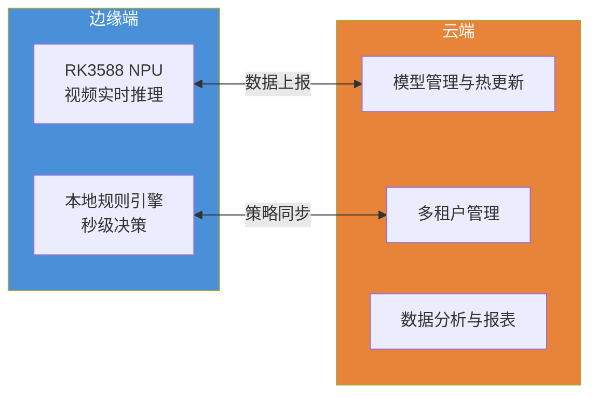

| 技术能力 | 详情 |
|----------|------|
| 边缘部署 | 支持 RK3588 等边缘 NPU 硬件，视频流本地推理，无需上传云端，延迟 < 3 秒 |
| 边云协同 | 边缘端实时推理 + 云端模型管理与数据分析，兼顾实时性与全局视角 |
| 多租户架构 | 独立数据库隔离，不同租户数据完全隔离，满足企业安全合规要求 |
| 模型热更新 | 算法参数在线配置，无需停机即可更新检测规则和模型版本 |
| 事件全生命周期 | 发现 → 处置 → 记录 → 分析 → 优化，每个事件可追溯、可统计、可优化 |
| 多模态融合 | 视频 + IoT 传感器 + 业务系统数据交叉验证，误报率降低 80%+ |

### 核心 AI 能力矩阵

| AI 能力 | 技术实现 | 应用场景 |
|---------|----------|----------|
| 目标检测 | YOLO 实时检测人员、车辆、设备、货物 | 人员入侵、叉车识别、货物管理 |
| 行为识别 | 时空动作识别模型 | 打架、跌倒、徘徊、奔跑 |
| 姿态估计 | 人体关键点检测 | 跌倒判断、异常姿态、步态分析 |
| 多目标跟踪 | DeepSORT / ByteTrack | 跨摄像头人员追踪、轨迹分析 |
| 行为基线建模 | 时序分析 + 异常检测 | 老人作息偏离、宠物活动量下降 |
| 多模态融合 | 视觉 + IoT 传感器数据关联 | 设备漏液诊断、植物缺水判断 |
| OCR 识别 | 文字检测与识别 | 标签检测、车牌识别 |

---

## 八、为什么选择我们

### 竞争优势对比

| 维度 | 传统视频监控 | 普通 AI 监控 | **我们的 AI 智能体平台** |
|------|------------|------------|------------------------|
| 工作模式 | 被动记录 | 检测 + 告警 | 感知 → 理解 → 判断 → 执行 → 验证 → 优化 |
| 分析深度 | 仅存储画面 | 单一事件检测 | 多维度关联推理 + 行为基线建模 |
| 响应方式 | 人工查看 | 推送告警 | 自动决策 + 设备联动 + 工单闭环 |
| 系统集成 | 无 | 独立运行 | 联动 WMS / MES / HIS / 消防 / 门禁 |
| 数据价值 | 证据留存 | 事件记录 | 趋势分析 + 预测性维护 + 决策辅助 |
| 场景覆盖 | 通用 | 单一场景 | 12 大行业方案统一平台 |
| 部署架构 | 中心服务器 | 云端或本地 | 边缘 + 云端协同，边缘端秒级响应 |
| 模型更新 | 不支持 | 需停机更新 | 在线热更新，无需停机 |

### 五大核心优势

1. **闭环而非告警** — 从发现到验证到优化，每个安全事件都有始有终
2. **多模态融合** — 视频 + IoT + 业务系统交叉验证，大幅降低误报
3. **12 场景统一平台** — 一个平台管理所有场景，无需采购多套系统
4. **边缘秒级响应** — 边缘 NPU 本地推理，从检测到告警延迟 < 3 秒
5. **模型在线热更新** — 算法参数实时配置，系统持续进化

---

## 九、联系我们

**AI 视频安全智能体平台**

让每一个摄像头成为会思考的安全智能体

 

| 联系方式 |  |
|----------|--|
| 商务合作 | 请联系您的客户经理 |
| 技术咨询 | 请联系技术支持团队 |
| 方案定制 | 支持按行业/场景定制化部署 |

 

---

本文档为产品宣传资料，具体功能以实际部署版本为准。&copy; 2026 AI 视频安全智能体平台

